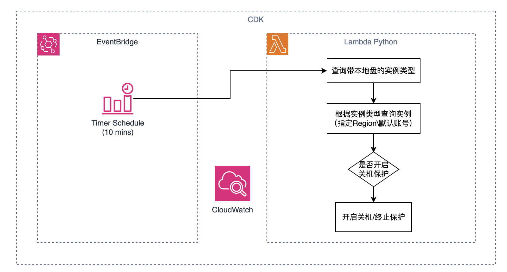

# 功能介绍
该方案主要基于AWS的EC2的保护进行管理，初衷是为了减少误操作关机/终止实例带来的实例存储本地盘数据丢失的影响，部署后主要实现以下功能：

1. 部署Lambda Function
   1. 查询所有指定可用区（us-west-2)的带有本地盘的实例类型；
   2. 根据查询出的实例类型查询用户账号下所有匹配的实例；
   3. 检查实例的状态是否已经开启了关机保护和终止保护；如果已经开启则跳过；如果未开启则执行开启；
   4. 设置Lambda Function的权限、超时时间为15分钟。
2. 创建 EventBridge Rule，并作为Lambda Function的触发器，每10分钟触发一次Lambda，执行检测1次。





### 注意：
任何人可以基于此代码完成任何部署并自行评估是否可以部署，自行承担部署、可用性、风险、部署后带来的影响等，与作者无关。

# 安装依赖组件

1. 安装 Python 3.9 或更高版本
   ```bash
   # Ubuntu/Debian
   sudo apt update
   sudo apt install python3.9
   
   # CentOS/RHEL
   sudo yum install python39
   ```

2. 安装 AWS CLI
   ```bash
   # Linux
   curl "https://awscli.amazonaws.com/awscli-exe-linux-x86_64.zip" -o "awscliv2.zip"
   unzip awscliv2.zip
   sudo ./aws/install
   
   # macOS (使用 Homebrew)
   brew install awscli
   ```

3. 安装 AWS CDK CLI
   ```bash
   npm install -g aws-cdk
   ```

4. 配置 AWS 凭证
   ```bash
   aws configure
   ```

# AWS 凭证权限要求

部署此 CDK 应用程序需要以下 AWS IAM 权限:

1. CDK 部署基础权限:
   - cloudformation:*
   - iam:CreateRole
   - iam:DeleteRole 
   - iam:PutRolePolicy
   - iam:DeleteRolePolicy
   - iam:GetRole
   - iam:GetRolePolicy
   - iam:PassRole

2. Lambda 相关权限:
   - lambda:CreateFunction
   - lambda:DeleteFunction
   - lambda:GetFunction
   - lambda:UpdateFunctionCode
   - lambda:UpdateFunctionConfiguration

3. EventBridge 相关权限:
   - events:PutRule
   - events:DeleteRule
   - events:PutTargets
   - events:RemoveTargets

4. Lambda 函数运行时所需权限:
   - ec2:DescribeInstanceTypes
   - ec2:DescribeInstances
   - ec2:ModifyInstanceAttribute

建议创建具有以上权限的 IAM 用户或角色来部署此应用。


## 部署

```bash
./deploy_cdk.sh
```

## 删除

```bash
./destroy_cdk.sh
```

